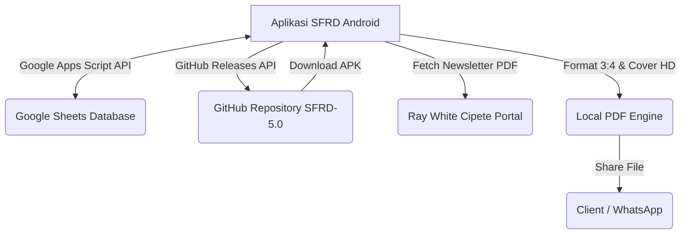

# 📱 SFRD — Schedule Foto RWC (Version 5.8)

  
  
  
  
  

---

**SFRD (Schedule Foto RWC)** adalah aplikasi Android modern yang dirancang khusus untuk mengelola, menyinkronkan, dan memantau jadwal foto, editing, serta materi mingguan (Weekly Meeting) agen marketing Ray White Cipete secara real-time langsung terhubung ke Google Sheets.

---

## 🌟 Fitur Utama

### 1. 🗓️ Meeting Control & Scheduling Desk
* Pembagian listing ke kategori **Scheduled** dan **Unscheduled** secara rapi.
* Fitur native **DatePicker** untuk memperbarui tanggal jadwal posting Instagram secara real-time.
* Sinkronisasi instan dua arah ke spreadsheet Recap Meeting.

### 2. 📄 Generator Newsletter PDF & JPG Instan (Ratio 3:4 HD)
* Mengunduh materi PDF Client dari portal Ray White secara langsung.
* Mengatur ulang seluruh halaman PDF secara otomatis ke rasio **Instagram Portrait 3:4 (819x1024)** tanpa cropping dan tanpa distorsi gambar (tidak gepeng).
* **Cover Page HD**: Merender cover beresolusi 2x (**1638x2048**) lengkap dengan filter gambar agar foto rumah dan logo super tajam.
* **Invisible Hyperlinks**: Halaman PDF dilengkapi link transparan di atas foto listing, sehingga jika gambar diklik oleh client, browser akan otomatis membuka detail listing properti di web.

### 3. 🔄 Real-time Background Sync & Auto Alarms
* Sinkronisasi data di latar belakang menggunakan Android Foreground Service.
* Mengatur alarm pengingat jadwal foto secara otomatis jika ada penambahan jadwal baru.
* Getaran notifikasi (*Vibration Feedback*) khusus saat sistem mendeteksi rilis/materi baru dari portal.

### 4. 🚀 GitHub Auto-Updater (Pembaruan Mandiri)
* Pengecekan otomatis rilis terbaru langsung ke repository GitHub `DhavidFebrian/SFRD-5.0`.
* Unduhan file APK di latar belakang dengan linear progress bar.
* Pemicu instalasi langsung dari dalam aplikasi (Package Installer API) lengkap dengan penanganan izin *Unknown Sources*.

---

## 🛠️ Tech Stack & Arsitektur

### Frontend & Core
* **Language**: Kotlin (v2.2.10)
* **UI Framework**: Jetpack Compose & Material Design 3 (Sleek Dark & Light Mode)
* **Image Loading**: Coil (Optimized Memory & 512MB Local Disk Caching)
* **Database**: Room DB (Local Caching)
* **Networking**: OkHttp3, Moshi, Retrofit 2 (Type-safe JSON Parsing)

### Backend
* **Database & Engine**: Google Sheets & Google Apps Script API (V6.1)
* **File Sharing Security**: Android FileProvider API

---

## 🚀 Cara Instalasi & Penggunaan

### Prasyarat
* Android 8.0 (Oreo) ke atas (API 26+)
* Mengaktifkan opsi **Instal aplikasi dari sumber tidak dikenal** (*Unknown Sources*) di HP Anda.

### Panduan Instalasi Pertama
1. Unduh rilis APK terbaru dari menu **[Releases](https://github.com/DhavidFebrian/SFRD-5.0/releases)** di repository ini.
2. Pasang file `app-debug.apk` di smartphone Anda.
3. Buka aplikasi, masuk ke menu **Setting**, masukkan **URL Google Apps Script** Anda, lalu tekan **Save**.

### Cara Melakukan Update Aplikasi ke Pengguna Lain (Developer)
1. Setelah melakukan perubahan kode, kompilasi aplikasi untuk menghasilkan file APK baru (`app-debug.apk`).
2. Masuk ke halaman **[New Release](https://github.com/DhavidFebrian/SFRD-5.0/releases/new)**.
3. Buat tag baru (misal `v5.9`), tulis judul rilis, lalu unggah file APK baru Anda di kolom *Attach binaries*.
4. Klik **Publish release**. Aplikasi pada perangkat semua pengguna secara otomatis akan menampilkan notifikasi update dan siap diunduh instan!

---

## 👨‍💻 Developer & Maintenance
Aplikasi ini dikembangkan dan dipelihara secara eksklusif oleh:

**Dhavid Febrian**  
*Ray White Cipete Tech & Social Media Operations*  
* Repository: [DhavidFebrian/SFRD-5.0](https://github.com/DhavidFebrian/SFRD-5.0)
