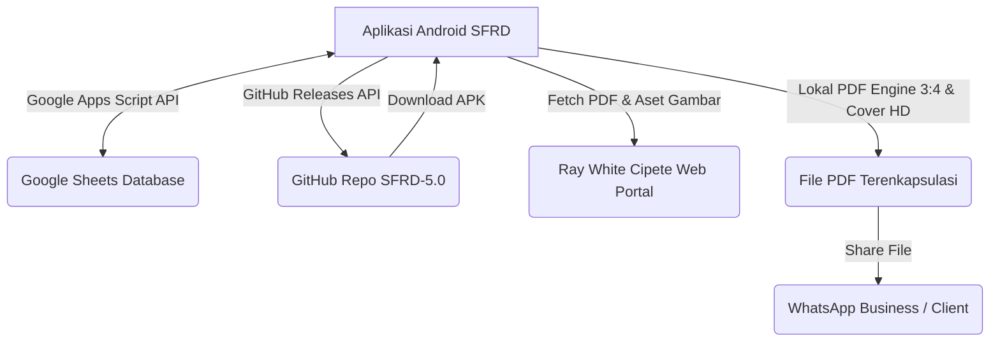

# 📱 SFRD — Schedule Foto RWC (Version 8.6.1)

<div align="center">
  
  
  
  
  
  
</div>

---

**SFRD (Schedule Foto RWC)** adalah aplikasi Android enterprise-grade yang dirancang khusus untuk mengotomatisasi, menyinkronkan, dan memantau jadwal foto, editing, kehadiran agen, serta seluruh materi pembahasan rapat mingguan (**Weekly Meeting**) Ray White Cipete. 

Aplikasi ini bertindak sebagai jembatan dua arah (*bi-directional sync*) secara real-time antara perangkat seluler tim di lapangan dengan **Google Sheets Database** melalui **Google Apps Script API Engine**.

---

## 🛠️ Peta Modul & Penjelasan Fitur

Aplikasi SFRD terdiri dari modul-modul utama berikut yang saling terintegrasi:

| Nama Modul / Fitur | File UI Screen | Deskripsi Fungsional & Kegunaan |
| :--- | :--- | :--- |
| **Dashboard Utama** | [`DashboardScreen.kt`](file:///c:/Users/dhavi/antigravity/SFRD/app/src/main/java/com/example/ui/screens/DashboardScreen.kt) | Halaman beranda untuk melihat ringkasan tugas hari ini, pintasan menu cepat, status sinkronisasi, dan grafik progres bulanan. |
| **Weekly Meeting Workspace** | [`WeeklyMeetingScreen.kt`](file:///c:/Users/dhavi/antigravity/SFRD/app/src/main/java/com/example/ui/screens/WeeklyMeetingScreen.kt) | Tempat menginput data listing hasil rapat, mengatur catatan edit foto, mewarnai status listing, serta meninjau posting Instagram. |
| **Desk Penjadwalan** | [`SchedulingDialog.kt`](file:///c:/Users/dhavi/antigravity/SFRD/app/src/main/java/com/example/ui/screens/SchedulingDialog.kt) | Mengatur jadwal posting Instagram untuk tiap listing (Scheduled vs Unscheduled) menggunakan DatePicker native Android. |
| **Absensi Rapat** | [`AbsenWeeklyMeetingScreen.kt`](file:///c:/Users/dhavi/antigravity/SFRD/app/src/main/java/com/example/ui/screens/AbsenWeeklyMeetingScreen.kt) | Pencatatan absensi marketing (ME) yang hadir rapat secara digital, sinkron instan ke kolom tanggal meeting di spreadsheet. |
| **Ringkasan Analisis** | [`AnalyticScreen.kt`](file:///c:/Users/dhavi/antigravity/SFRD/app/src/main/java/com/example/ui/screens/AnalyticScreen.kt) | Dashboard visualisasi data target meeting bulanan/tahunan (Donut Chart, progress bars) dan generator laporan teks WhatsApp. |
| **Mockup Feed Instagram** | [`InstagramPostMockupScreen.kt`](file:///c:/Users/dhavi/antigravity/SFRD/app/src/main/java/com/example/ui/screens/InstagramPostMockupScreen.kt) | Generator mockup feed Instagram untuk mensimulasikan tampilan visual listing properti sebelum di-upload ke media sosial. |
| **Generator Newsletter PDF** | [`NewsletterDialog.kt`](file:///c:/Users/dhavi/antigravity/SFRD/app/src/main/java/com/example/ui/screens/NewsletterDialog.kt) | Mengubah PDF portal properti menjadi format Instagram Portrait 3:4 HD secara otomatis, lengkap dengan cover tajam dan link tersembunyi. |
| **Galeri & Downloader** | [`DownloadImagesScreen.kt`](file:///c:/Users/dhavi/antigravity/SFRD/app/src/main/java/com/example/ui/screens/DownloadImagesScreen.kt) | Mengunduh seluruh aset gambar properti beresolusi tinggi langsung dari portal ke penyimpanan perangkat dalam satu ketukan. |

---

## 📖 Panduan Penggunaan Langkah-demi-Langkah

### 1. Cara Menambah & Mengedit Data Rapat Mingguan
* Buka menu **Weekly Meeting** di navigasi bawah.
* Klik tombol **Tambah Data** (+).
* Masukkan **ID Listing** properti. Sistem akan secara otomatis mencari (*auto-fill*) nama ME (Marketing Executive) yang terdaftar, judul listing, kisaran harga, dan deskripsinya dari portal.
* Pada opsi **Keterangan**, pilih label yang sesuai:
  * <span style="color:#FF5722">**HOT PROPERTY**</span>: Untuk properti unggulan yang sangat potensial terjual cepat.
  * <span style="color:#E1306C">**IG**</span>: Untuk properti yang ditargetkan diposting ke Instagram.
  * <span style="color:#2196F3">**FOTO ULANG**</span>: Untuk instruksi pemotretan kembali.
* Anda juga dapat memilih opsi **Template Catatan** edit cepat seperti *ratio*, *perspective*, dan *remove object*.
* Klik **Simpan**. Data akan langsung terkirim ke Google Sheets.

### 2. Cara Mengatur Tanggal Posting Instagram (Scheduling Desk)
* Di halaman Weekly Meeting, klik ikon kalender / **Scheduling Desk** di bar atas.
* Pilih tab **Unscheduled** untuk melihat listing yang belum dijadwalkan postingnya.
* Klik salah satu listing properti, pilih tanggal melalui dialog **DatePicker**, lalu konfirmasi.
* Properti akan berpindah ke tab **Scheduled** dan kolom jadwal posting di spreadsheet akan otomatis terisi sesuai tanggal pilihan.

### 3. Cara Mengisi Absensi Kehadiran Marketing (ME)
* Pilih menu **Absen Meeting** di dalam Workspace Weekly Meeting.
* Pilih tanggal rapat mingguan yang sedang berjalan di bagian atas.
* Beri tanda centang (check) pada nama-nama Marketing Executive (ME) yang hadir rapat.
* Sistem akan secara otomatis mengirimkan status kehadiran ke kolom Google Sheets yang bersangkutan.

### 4. Cara Melihat Analisis & Membagikan Laporan Rekap ke WhatsApp
* Masuk ke halaman **Ringkasan Analisis** dari tombol analitik di pojok atas.
* Pilih filter periode bulan di bagian atas (contoh: *"Juli 2026"* atau *"Semua Bulan 2026"*).
* Tinjau pembagian target mingguan pada diagram lingkaran (**Donut Chart**) di Tab *Distribusi Target*.
* Pada Tab *Status Instagram*, Anda bisa melihat persentase listing yang sudah diposting vs pending.
* Klik tombol **WhatsApp Business** atau **Salin Teks** untuk membagikan rangkuman laporan terformat rapi (termasuk daftar link listing yang pending) langsung ke grup koordinasi kantor.

### 5. Cara Cetak & Bagikan Newsletter PDF (Instagram 3:4 HD)
* Klik tombol **Buat Newsletter** pada halaman detail listing.
* Masukkan URL PDF materi promosi portal Ray White Cipete.
* Mesin PDF lokal aplikasi akan bekerja secara cerdas:
  * Mengompres dan memotong halaman promosi agar berasio **3:4 Portrait** agar pas di feed/story tanpa bagian yang terpotong.
  * Membuat cover properti dengan ketajaman gambar 2x HD.
  * Menyisipkan **Link Transparan** di atas foto rumah, sehingga client yang membaca PDF di HP bisa mengklik gambar untuk diarahkan langsung ke halaman detail website properti.
* Setelah selesai, Anda bisa langsung membagikan PDF tersebut ke WhatsApp client.

---

## 🛠️ Tech Stack & Arsitektur Sistem



### Spesifikasi Teknis:
* **UI**: Jetpack Compose, Material 3, dynamic rendering.
* **Asynchronous**: Kotlin Coroutines & Flow API.
* **Networking**: Retrofit 2, OkHttp3 (dengan progress listener download), Moshi JSON adapter.
* **Image Caching**: Coil Engine (512MB disk space cache + memory cache).
* **Package Installer**: FileProvider API untuk keamanan bypass instalasi APK internal.

---

## 💻 Panduan Deploy Google Apps Script untuk Developer

Aplikasi ini memerlukan Google Apps Script untuk bertindak sebagai API. Ikuti langkah berikut untuk menyiapkannya:

### Langkah 1: Siapkan Spreadsheet
Buat Google Spreadsheet baru atau gunakan yang sudah ada. Dapatkan **Spreadsheet ID** dari URL browser Anda:
`https://docs.google.com/spreadsheets/d/ SPREADSHEET_ID_ANDA /edit`

### Langkah 2: Deploy Kode Apps Script
1. Buka spreadsheet Anda, pilih menu **Ekstensi -> Apps Script**.
2. Salin seluruh isi file [`apps_script_full.js`](file:///C:/Users/dhavi/.gemini/antigravity-ide/brain/775a99fe-ef51-4484-88ca-cf9d62e14f8d/apps_script_full.js) dari folder project ini (atau dari halaman template salin di menu **Setting** aplikasi).
3. Hapus kode bawaan di editor Apps Script, lalu paste kode tersebut.
4. Sesuaikan konstanta `weeklyMeetingSpreadsheetId` di dalam kode script dengan ID spreadsheet Anda.
5. Klik ikon **Simpan** (Save).
6. Klik **Terapkan (Deploy) -> Penerapan Baru (New Deployment)**.
7. Pilih Jenis Penerapan: **Aplikasi Web (Web App)**.
8. Setel izin akses:
   * **Jalankan sebagai (Execute as)**: `Saya (email Anda)`
   * **Siapa yang memiliki akses (Who has access)**: `Siapa saja (Anyone)`
9. Klik **Terapkan (Deploy)**. Salin **URL Aplikasi Web** yang diberikan (URL ini akan berakhiran `/exec`).

### Langkah 3: Konfigurasi Aplikasi SFRD
1. Buka aplikasi SFRD di handphone Anda.
2. Masuk ke halaman **Setting** (ikon roda gigi).
3. Paste URL Apps Script (`/exec`) yang Anda salin tadi ke kolom **Apps Script URL**.
4. Tekan **Save**. Aplikasi Anda sekarang sudah terhubung penuh ke Google Sheets!

---

## 🚀 Panduan Rilis & Update Aplikasi (Auto-Update Versioning)

Sistem auto-update aplikasi ini berbasis integrasi API GitHub Releases. Agar tidak terjadi error loop notifikasi pembaruan pada handphone pengguna, ikuti aturan build berikut:

1. **Ubah Versi Sebelum Build**:  
   Buka file [`app/build.gradle.kts`](file:///c:/Users/dhavi/antigravity/SFRD/app/build.gradle.kts), naikkan `versionCode` dan `versionName` di block `defaultConfig`:
   ```kotlin
   defaultConfig {
       versionCode = 861    // Naikkan kode (misal 861)
    versionName = "8.6.1" // Samakan dengan nama tag rilis target (misal 8.6.1)
   }
   ```
2. **Kompilasi APK**:  
   Gunakan terminal di IDE ini untuk membuild rilis APK final:
   ```bash
   ./gradlew assembleDebug
   ```
   *File APK rilis Anda akan terbentuk di:*  
   👉 **`app/build/outputs/apk/debug/app-debug.apk`**
3. **Push Kode Terupdate ke GitHub**:
   ```bash
   git add .
    git commit -m "Release version 8.6.1"
   git push origin main
   ```
4. **Buat Release di GitHub**:
   * Buka menu **Releases -> Draft a new release** di GitHub.
    * Buat tag baru dengan nama tag yang sama persis seperti versi tadi (contoh: **`8.6.1`** atau **`v8.6.1`**).
   * Unggah file `app-debug.apk` hasil build di atas ke kolom unggahan aset biner rilis.
   * Publish rilis tersebut. Aplikasi di seluruh handphone pengguna otomatis akan memunculkan dialog pop-up tengah untuk mengunduh update terbaru!

---

## 👨‍💻 Developer & Maintenance
Aplikasi ini dikembangkan dan dipelihara secara eksklusif oleh:

**Dhavid Febrian**  
*Ray White Cipete Tech & Social Media Operations*  
* Repository: [DhavidFebrian/SFRD-5.0](https://github.com/DhavidFebrian/SFRD-5.0)
