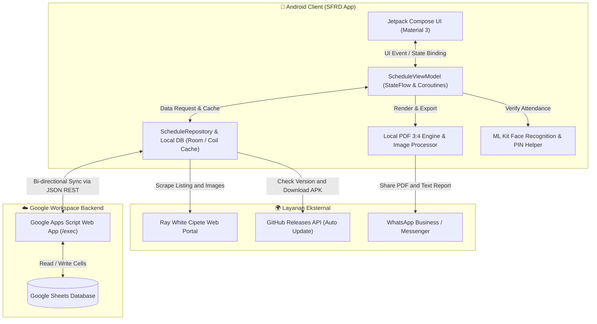
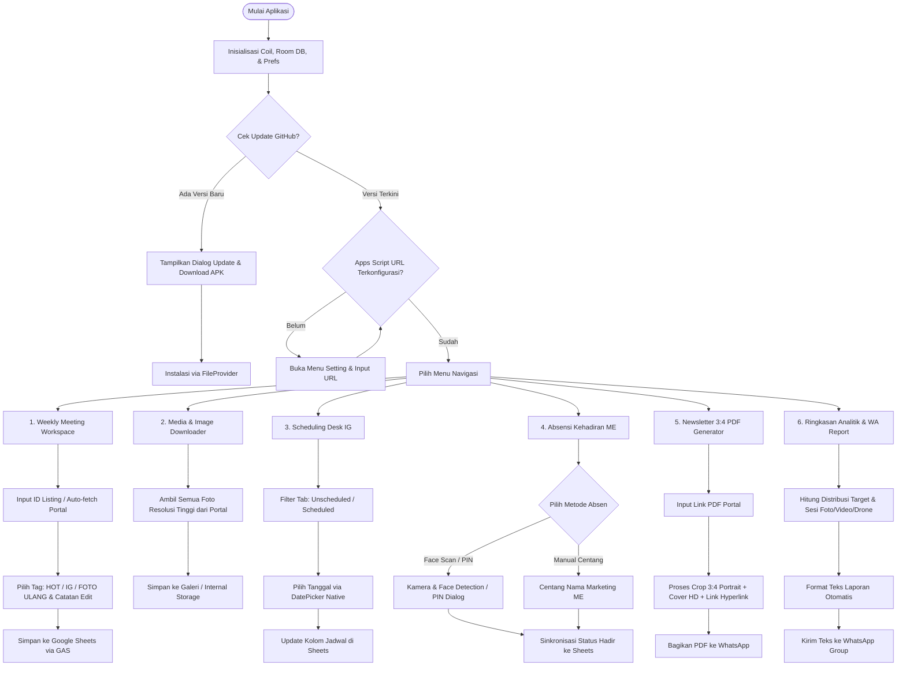
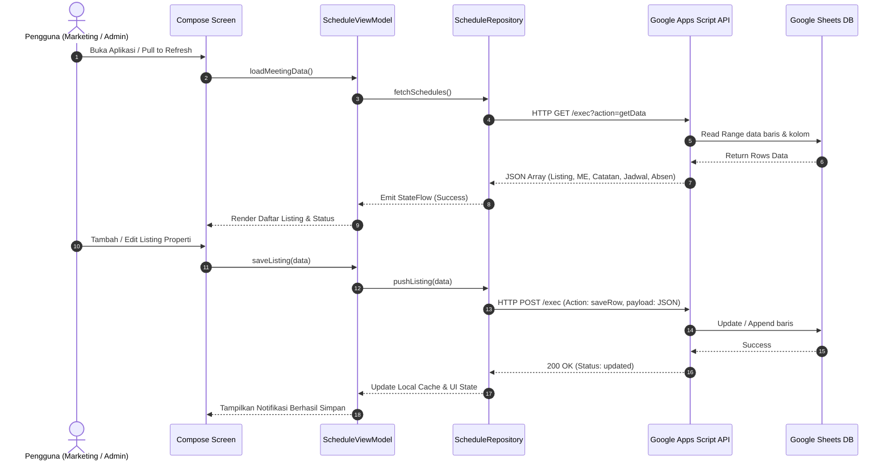

# 📊 Diagram Alur Sistem SFRD (Schedule Foto RWC)

Dokumentasi diagram arsitektur dan alur kerja komprehensif untuk aplikasi **SFRD**.

---

## 1. 🌐 Arsitektur Sistem Global

Diagram berikut menggambarkan interaksi antara komponen aplikasi Android SFRD dengan service eksternal (Google Sheets, Portal Ray White, WhatsApp, GitHub OTA).

---

## 2. 🔄 Alur Kerja Utama Aplikasi (End-to-End User Flow)

---

## 3. ⏱️ Sequence Diagram: Sinkronisasi Dua Arah (Bi-directional Sync)

---

## 4. 📄 Sequence Diagram: Pemrosesan & Konversi Newsletter 3:4 PDF

```mermaid
sequenceDiagram
    autonumber
    actor User as Tim Marketing
    participant UI as NewsletterDialog
    participant Downloader as NewsletterDownloader
    participant Engine as Local PDF Processor
    participant WA as WhatsApp App

    User->>UI: Masukkan URL Brosur PDF Portal
    UI->>Downloader: startDownloadAndConvert(url)
    Downloader->>Downloader: Download raw PDF file ke cache
    Downloader->>Engine: convertA4ToPortrait34(pdfBytes)
    
    rect rgb(30, 40, 60)
        Note over Engine: 1. Render halaman PDF asli ke Bitmap HD<br/>2. Stretch pixel sisi kiri & kanan (Bebas distorsi)<br/>3. Hitung posisi teks cover & background dinamis<br/>4. Sisipkan interactive link overlay di atas gambar
    end
    
    Engine-->>Downloader: File PDF Baru (3:4 Portrait HD)
    Downloader-->>UI: File Uri siap dibagikan
    UI->>WA: Intent ACTION_SEND (MIME: application/pdf)
    WA-->>User: Tampilkan dialog kirim ke kontak/grup WhatsApp
```

